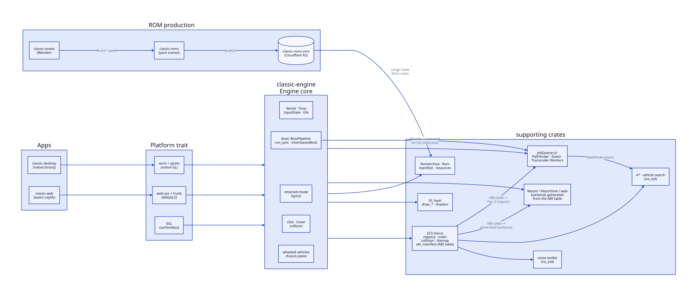

# classic-wgl

A small isometric game engine with a retained-mode UI/layout layer, written in
Rust. Two targets — **native** (winit + glutin, desktop GL) and **web**
(web-sys + trunk, WebGL 2) — plus a **headless** (EGL) backend for CI/golden
tests. There is no framework: the whole app is a single `<canvas>` / winit
window.

Game content ships as self-contained **ROMs**: a zip archive bundling a
per-scene manifest, entity state, resources (textures, fonts, animations, and
binary tile/nav/height grids), and one or more compiled WASM guest modules.
The ROMs are built and published by the sibling `classic-roms` repo to a
Cloudflare R2 bucket served at [`classic-roms.com`](https://classic-roms.com),
and fetched locally with `cargo xtask fetch-roms`.

## History

`classic-wgl` started life as a fully **hand-authored JavaScript + WebGL
codebase** — an isometric tile renderer, a worker-based A* pathfinder, and the
demo assembled from `camera.js`, `prefabs.js` and friends. It was restructured
for Node/Vite and migrated to **TypeScript** (strict mode) in mid-2025
(`9c8e289` "migrate codebase from JavaScript to TypeScript with strict mode",
`28a0200` "restructured project for nodejs, typescript and vite").

In 2026 the engine was **ported to Rust** (`f469cb2` "Add Rust port of
classic-wgl — 7 crates, native + web, parity with TS engine"), and the
TypeScript engine + tooling were dropped entirely (`395574a` "Drop TypeScript
engine and tooling (−19 000 LOC)"). The current shape is the result of that
migration plus the **ROM system**: game content left the engine repo entirely
and now flows `classic-assets` → `classic-roms` → `classic-roms.com` → the
engine, which fetches and boots self-contained scene ROMs.

## Architecture



The diagram above is authored in [d2](https://d2lang.com) — source of truth is
[`docs/architecture.d2`](docs/architecture.d2), rendered to
[`docs/architecture.svg`](docs/architecture.svg). Regenerate it with:

```bash
nix develop ./docs -c d2 docs/architecture.d2 docs/architecture.svg   # one-shot
nix build ./docs#architecture                                         # reproducible render into the store
```

The workspace (`Cargo.toml`, 14 members) is split into layers. Full details in
[`AGENTS.md`](AGENTS.md); the short version:

| Layer | Crates | What it does |
|---|---|---|
| **Apps** | `apps/desktop`, `apps/web` | native binary / wasm cdylib entry points |
| **Platform** | `classic-platform` | `Platform` trait: native (winit), web (web-sys), headless (EGL) |
| **Engine** | `classic-engine` | generic core: lifecycle + hook surface, `UIManager`, vehicles, golden traces |
| **Core** | `classic-core` | ECS (`hecs`), component registry, math, collision, tilemap, SDF |
| **Graphics** | `classic-gfx` | GL layer: `draw_*` fns, buffers, shaders |
| **Terrain / Path** | `classic-terrain`, `classic-pathfinder` | `#![no_std]` noise toolkit and A*/vehicle search |
| **ROM** | `classic-rom` | `RomArchive`/`Rom`, manifest, `ResourceSet` |
| **Guest runtime** | `classic-guest` | Wasmi (wasm) / Wasmtime (native) + guest ABI & SDK (sandboxed) |
| **Workers** | `classic-worker` | `PathfinderWorker`, Tier-3 `GuestWorker` |
| **Demo** | `classic-demo` | application/prefab layer: `init_engine`, `DemoState`, scene assemblers |

## Quickstart

### Prerequisites

The supported path is [Nix](https://nixos.org): `nix develop` provides the Rust
toolchain, the `wasm32-unknown-unknown` target, and the GL/EGL system deps. On
a plain system you can instead use `rustup` and install the equivalent packages
(`libegl1-mesa-dev`, `libgl1-mesa-dri`, `libgbm-dev`, `libx11-dev`).

### Clone, fetch ROMs, run

```bash
git clone https://github.com/guilledk/classic-wgl.git
cd classic-wgl

nix develop                 # dev shell (Rust toolchain, wasm target, GL/EGL deps)
cargo xtask fetch-roms      # stage the published scene ROMs into roms/out/

cargo run -p classic-desktop                          # native — boots the demo scene
CLASSIC_ROM=rom:lunar cargo run -p classic-desktop    # native — boots the lunar scene
```

The ROMs come from the `classic-roms.com` bucket (`demo.rom`, `lunar.rom`,
`lrvtest.rom`), verified against the published `roms.json` checksums. Only the
**lunar** scene is a playable scene for now — a 400×400 procedurally generated
map (layered simplex noise + meteorite crater field) with a landing rocket and
the LRV rover. `demo` is the interactive tech demo, `lrvtest` the vehicle test
course. (`moon` is a legacy alias for `lunar`.)

### Web target

```bash
trunk serve apps/web/index.html          # web dev server
# open http://localhost:8080/?rom=lunar
trunk build apps/web/index.html --release  # web release
```

The web app fetches its ROMs straight from `classic-roms.com` (CORS-enabled),
caching them in the browser's Cache API by content hash. `?rom=<name>` selects
the scene; `?classic_log=` enables channel logging.

## Engine skills

Detailed, per-subsystem reference docs live as skills under `.agents/skills/`:

| Skill | Covers |
|---|---|
| `classic-iso` | Iso coords, tilemap, depth formula, sprite occlusion, mesh gen |
| `classic-terrain` | Open noise toolkit (simplex, fractal combinators) + lunar generator recipe |
| `classic-procmaps` | Authoring/scaling procedural maps, new-generator recipe, size envelope |
| `classic-ui` | `UIManager`, anchor layout, collider sync, `spawn_button` |
| `classic-text` | SdfText renderer, atlas generator, scissor clipping |
| `classic-gfx` | `draw_*` functions, GL state contract, `begin_frame` |
| `classic-physics` | `PhysicsProvider`, click/hover/enter/exit dispatch, pathfinder |
| `classic-ecs` | `hecs` patterns, component registry, `update_fns`, camera math |
| `classic-platform` | Native/web/headless backends, `InputState`, window/keyboard/mouse |
| `classic-testing` | `CLASSIC_TEST`, golden harness, scenario authoring |
| `classic-debugging` | `CLASSIC_LOG` channels, runtime toggles, debugging playbook |
| `classic-guest` | WASM guest runtime, ABI, `GuestRuntime` trait, sandbox (fuel + memory) |

## Testing

```bash
cargo test                    # all unit/integration tests
cargo fmt --all -- --check    # formatting
cargo clippy --all-targets -- -D warnings
```

The headless e2e + golden harness runs under `LIBGL_ALWAYS_SOFTWARE=1` and
`EGL_PLATFORM=surfaceless` — see [`AGENTS.md`](AGENTS.md) for the exact
invocations and the full `CLASSIC_*` environment-variable reference.

## GLSL resources

- https://learnwebgl.brown37.net/12_shader_language/documents/webgl-reference-card-1_0.pdf
- https://learnwebgl.brown37.net/12_shader_language/glsl_mathematical_operations.html
- https://gist.github.com/patriciogonzalezvivo/670c22f3966e662d2f83
